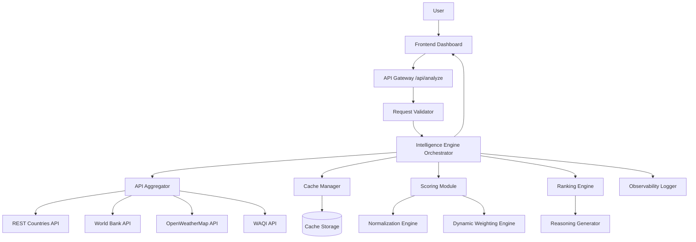

# Design Document

## Overview

The Global Relocation & Travel Decision Intelligence Engine is a full-stack decision support system that provides ranked country recommendations based on real-time data aggregation, multi-factor analysis, and dynamic weighting. The system architecture follows a modular backend design with clear separation between API integration, data processing, scoring, caching, and presentation layers.

The backend orchestrates concurrent API calls to four external data sources (REST Countries, World Bank, OpenWeatherMap, WAQI), normalizes heterogeneous metrics to a uniform 0-100 scale, applies dynamic weighting based on user preferences, and returns ranked results with explainable reasoning. A 60-minute caching layer ensures sub-200ms response times for repeated queries while maintaining data freshness.

The frontend provides an intuitive dashboard for preference input and result visualization, handling loading states, partial failures, and network errors gracefully.

Key design principles:
- **Modularity**: Clear separation of concerns enables independent testing and maintenance
- **Resilience**: Partial failure handling ensures availability even when external APIs fail
- **Performance**: Concurrent API calls and intelligent caching meet sub-2-second response requirements
- **Explainability**: Structured reasoning provides transparency in ranking decisions
- **Testability**: Property-based testing validates critical invariants across input spaces

## Architecture

### High-Level Architecture



### Component Responsibilities

**Frontend Dashboard**
- User input collection (countries, risk tolerance, duration)
- Request submission and loading state management
- Result visualization with score breakdowns and reasoning
- Error and partial failure warning display

**API Gateway**
- HTTP endpoint exposure (/api/analyze)
- Request routing to Intelligence Engine
- Response formatting and HTTP status code management

**Request Validator**
- Input validation (minimum 3 countries, valid risk tolerance, valid duration)
- Error message generation for invalid requests

**Intelligence Engine Orchestrator**
- Workflow coordination across all backend components
- Metadata aggregation (cache hits/misses, processing time, failures)
- Response assembly with ranked results and reasoning

**API Aggregator**
- Concurrent API call execution with timeout handling
- Response parsing and error handling
- Integration with Cache Manager for data retrieval

**Cache Manager**
- 60-minute TTL cache storage and retrieval
- Cache hit/miss tracking and metadata generation
- Expiration-based invalidation

**Scoring Module**
- Normalization of raw metrics to 0-100 scale
- Intelligence score computation (Travel Risk, Health Infrastructure, Environmental Stability)
- Dynamic weight calculation based on user preferences
- Weighted score aggregation

**Ranking Engine**
- Country sorting by weighted intelligence scores
- Tiebreaker application (alphabetical order)
- Result ordering for response

**Reasoning Generator**
- Structured reasoning text generation
- Multi-factor explanation synthesis
- Reasoning summary formatting

**Observability Logger**
- Event logging (API calls, cache operations, scoring, failures)
- Performance metric tracking (durations, timestamps)
- Debugging and monitoring support

### Data Flow

1. **Request Phase**: User submits preferences → Dashboard sends POST to /api/analyze → Validator checks inputs
2. **Aggregation Phase**: Engine requests data → Cache Manager checks cache → API Aggregator fetches missing data concurrently → Cache Manager stores fresh data
3. **Processing Phase**: Scoring Module normalizes metrics → Computes intelligence scores → Applies dynamic weights → Generates weighted scores
4. **Ranking Phase**: Ranking Engine sorts countries → Reasoning Generator creates explanations → Engine assembles response with metadata
5. **Response Phase**: Engine returns JSON → Dashboard renders results with scores and reasoning

### Technology Stack Recommendations

**Backend**
- Runtime: Node.js (async/await for concurrent API calls) or Python (asyncio for concurrency)
- Framework: Express.js (Node) or FastAPI (Python) for REST API
- HTTP Client: axios (Node) or httpx (Python) for external API calls
- Cache: In-memory Map/Dictionary with TTL tracking, or Redis for distributed caching
- Logging: winston (Node) or structlog (Python) for structured logging

**Frontend**
- Framework: React or Vue.js for component-based UI
- State Management: React Context/Hooks or Vue Composition API
- HTTP Client: fetch API or axios
- UI Components: Material-UI, Ant Design, or Tailwind CSS for styling

**Testing**
- Property-Based Testing: fast-check (JavaScript/TypeScript) or Hypothesis (Python)
- Unit Testing: Jest (JavaScript) or pytest (Python)
- Integration Testing: Supertest (Node) or TestClient (FastAPI)

## Components and Interfaces

### API Aggregator

**Purpose**: Fetch data from external APIs concurrently with timeout and error handling

**Interface**:
```typescript
interface APIAggregator {
  fetchCountryData(countries: string[]): Promise<AggregatedData>
}

interface AggregatedData {
  countries: Map<string, CountryData>
  failures: APIFailure[]
  durations: Map<string, number>
}

interface CountryData {
  basicInfo: RestCountriesData | null
  healthData: WorldBankData | null
  weatherData: OpenWeatherData | null
  airQualityData: WAQIData | null
}

interface APIFailure {
  apiName: string
  country: string
  error: string
  timestamp: Date
}
```

**Behavior**:
- Executes API calls concurrently using Promise.all or equivalent
- Applies 5-second timeout per API call
- Logs call duration and status for each API
- Returns partial data on individual API failures
- Integrates with Cache Manager before making external calls

### Cache Manager

**Purpose**: Store and retrieve API responses with 60-minute TTL

**Interface**:
```typescript
interface CacheManager {
  get(key: string): CachedData | null
  set(key: string, data: any, ttl: number): void
  isExpired(key: string): boolean
  clear(key: string): void
}

interface CachedData {
  data: any
  timestamp: Date
  expiresAt: Date
}
```

**Behavior**:
- Generates cache keys from API name and country code
- Checks expiration before returning cached data
- Tracks cache hits and misses for metadata
- Automatically removes expired entries on access
- Logs all cache operations with timestamps

### Scoring Module

**Purpose**: Normalize metrics and compute intelligence scores with dynamic weighting

**Interface**:
```typescript
interface ScoringModule {
  computeScores(
    countryData: CountryData,
    preferences: UserPreferences
  ): IntelligenceScores
}

interface UserPreferences {
  riskTolerance: 'Low' | 'Moderate' | 'High'
  duration: 'Short-term' | 'Long-term'
}

interface IntelligenceScores {
  travelRiskScore: number        // 0-100
  healthInfrastructureScore: number  // 0-100
  environmentalStabilityScore: number  // 0-100
  weightedScore: number          // 0-100
  weights: ScoreWeights
}

interface ScoreWeights {
  travelRisk: number
  healthInfrastructure: number
  environmentalStability: number
}
```

**Behavior**:
- Normalizes all raw metrics to 0-100 scale using min-max normalization
- Clamps normalized values to [0, 100] range
- Computes Travel Risk Score from temperature extremes, AQI severity, advisory risk
- Computes Health Infrastructure Score from healthcare expenditure, life expectancy, population pressure
- Computes Environmental Stability Score from weather volatility, AQI trends
- Calculates dynamic weights based on risk tolerance and duration
- Computes weighted aggregate score for ranking

### Normalization Engine

**Purpose**: Convert heterogeneous metrics to uniform 0-100 scale

**Interface**:
```typescript
interface NormalizationEngine {
  normalize(value: number, min: number, max: number, invert?: boolean): number
}
```

**Normalization Strategies**:
- **Min-Max Normalization**: `normalized = ((value - min) / (max - min)) * 100`
- **Inverted Normalization**: `normalized = 100 - ((value - min) / (max - min)) * 100` (for metrics where lower is better)
- **Clamping**: `normalized = Math.max(0, Math.min(100, normalized))`

**Metric-Specific Ranges**:
- Temperature: -50°C to 50°C (extremes inverted)
- AQI: 0 to 500 (inverted)
- Life Expectancy: 50 to 85 years
- Healthcare Expenditure: 0% to 20% of GDP
- Population Density: 0 to 1000 per km² (inverted for pressure calculation)

### Dynamic Weighting Engine

**Purpose**: Calculate score weights based on user preferences

**Interface**:
```typescript
interface DynamicWeightingEngine {
  calculateWeights(preferences: UserPreferences): ScoreWeights
}
```

**Weighting Logic**:

Risk Tolerance Impact (on penalty factors within Travel Risk Score):
- Low: AQI penalty weight = 0.4, Advisory risk weight = 0.4, Temperature weight = 0.2
- Moderate: AQI penalty weight = 0.3, Advisory risk weight = 0.3, Temperature weight = 0.4
- High: AQI penalty weight = 0.2, Advisory risk weight = 0.2, Temperature weight = 0.6

Duration Impact (on final score aggregation):
- Short-term: Travel Risk = 0.3, Health Infrastructure = 0.2, Environmental Stability = 0.5
- Long-term: Travel Risk = 0.2, Health Infrastructure = 0.5, Environmental Stability = 0.3

**Computation**:
```
weightedScore = (travelRiskScore * travelRiskWeight) +
                (healthInfrastructureScore * healthInfrastructureWeight) +
                (environmentalStabilityScore * environmentalStabilityWeight)
```

### Ranking Engine

**Purpose**: Sort countries by weighted scores and apply tiebreakers

**Interface**:
```typescript
interface RankingEngine {
  rankCountries(scores: Map<string, IntelligenceScores>): RankedCountry[]
}

interface RankedCountry {
  country: string
  rank: number
  scores: IntelligenceScores
  reasoning: string
}
```

**Behavior**:
- Sorts countries by weightedScore in descending order
- Applies alphabetical tiebreaker when scores are equal
- Assigns rank numbers (1, 2, 3, ...)
- Integrates reasoning from Reasoning Generator

### Reasoning Generator

**Purpose**: Generate structured explanations for country rankings

**Interface**:
```typescript
interface ReasoningGenerator {
  generateReasoning(
    country: string,
    scores: IntelligenceScores,
    countryData: CountryData
  ): string
}
```

**Reasoning Template**:
```
"{Country} ranks {rank} with a weighted score of {score}/100. 
Key factors: {factor1} ({metric1}), {factor2} ({metric2}). 
{Additional context based on preferences}."
```

**Factor Selection**:
- Identifies top 2-3 contributing factors based on component scores
- References specific metrics (e.g., "excellent air quality (AQI: 25)", "strong healthcare infrastructure (12% GDP)")
- Adapts language based on user preferences (e.g., emphasizes health for long-term, environment for short-term)

### Request Validator

**Purpose**: Validate user input before processing

**Interface**:
```typescript
interface RequestValidator {
  validate(request: AnalysisRequest): ValidationResult
}

interface AnalysisRequest {
  countries: string[]
  riskTolerance: string
  duration: string
}

interface ValidationResult {
  valid: boolean
  errors: string[]
}
```

**Validation Rules**:
- Countries: Array with minimum length 3
- Risk Tolerance: Must be 'Low', 'Moderate', or 'High'
- Duration: Must be 'Short-term' or 'Long-term'

### Intelligence Engine Orchestrator

**Purpose**: Coordinate workflow across all components

**Interface**:
```typescript
interface IntelligenceEngine {
  analyze(request: AnalysisRequest): Promise<AnalysisResponse>
}

interface AnalysisResponse {
  results: RankedCountry[]
  metadata: ResponseMetadata
}

interface ResponseMetadata {
  processingTime: number
  cacheHits: number
  cacheMisses: number
  failures: APIFailure[]
  timestamp: Date
}
```

**Orchestration Flow**:
1. Validate request
2. Request data from API Aggregator (which uses Cache Manager)
3. For each country with sufficient data:
   - Compute intelligence scores via Scoring Module
4. Rank countries via Ranking Engine
5. Generate reasoning via Reasoning Generator
6. Assemble response with metadata
7. Log completion metrics

## Data Models

### External API Response Models

**REST Countries API**:
```typescript
interface RestCountriesData {
  name: string
  capital: string
  population: number
  area: number
  region: string
  subregion: string
}
```

**World Bank API**:
```typescript
interface WorldBankData {
  countryCode: string
  lifeExpectancy: number  // years
  healthcareExpenditure: number  // % of GDP
  year: number
}
```

**OpenWeatherMap API**:
```typescript
interface OpenWeatherData {
  city: string
  temperature: number  // Celsius
  tempMin: number
  tempMax: number
  humidity: number
  description: string
}
```

**WAQI API**:
```typescript
interface WAQIData {
  city: string
  aqi: number  // 0-500 scale
  dominantPollutant: string
  timestamp: Date
}
```

### Internal Data Models

**Normalized Metrics**:
```typescript
interface NormalizedMetrics {
  temperatureScore: number  // 0-100 (inverted from extremes)
  aqiScore: number  // 0-100 (inverted from raw AQI)
  lifeExpectancyScore: number  // 0-100
  healthcareExpenditureScore: number  // 0-100
  populationPressureScore: number  // 0-100 (inverted from density)
  weatherVolatilityScore: number  // 0-100 (from temp range)
}
```

**Intelligence Scores**:
```typescript
interface IntelligenceScores {
  travelRiskScore: number  // Derived from temperature, AQI, advisory
  healthInfrastructureScore: number  // Derived from healthcare, life expectancy, population
  environmentalStabilityScore: number  // Derived from weather volatility, AQI trends
  weightedScore: number  // Aggregated with dynamic weights
  weights: ScoreWeights
}
```

**Cache Entry**:
```typescript
interface CacheEntry {
  key: string  // Format: "{apiName}:{countryCode}"
  data: any  // API response
  timestamp: Date
  expiresAt: Date
  ttl: number  // milliseconds
}
```

### Database Schema (Optional)

If persistence is required beyond in-memory caching:

**cache_entries** table:
```sql
CREATE TABLE cache_entries (
  key VARCHAR(255) PRIMARY KEY,
  data JSONB NOT NULL,
  timestamp TIMESTAMP NOT NULL,
  expires_at TIMESTAMP NOT NULL
);

CREATE INDEX idx_expires_at ON cache_entries(expires_at);
```

**analysis_logs** table:
```sql
CREATE TABLE analysis_logs (
  id SERIAL PRIMARY KEY,
  request_id UUID NOT NULL,
  countries TEXT[] NOT NULL,
  risk_tolerance VARCHAR(20) NOT NULL,
  duration VARCHAR(20) NOT NULL,
  processing_time INTEGER NOT NULL,
  cache_hits INTEGER NOT NULL,
  cache_misses INTEGER NOT NULL,
  failures JSONB,
  timestamp TIMESTAMP NOT NULL
);
```


## Correctness Properties

*A property is a characteristic or behavior that should hold true across all valid executions of a system—essentially, a formal statement about what the system should do. Properties serve as the bridge between human-readable specifications and machine-verifiable correctness guarantees.*

### Property Reflection

After analyzing all acceptance criteria, I identified several areas of redundancy:

**Logging Properties (11.1-11.6, 1.6, 4.6, 5.3)**: Multiple criteria specify logging for different events. Rather than separate properties for each log type, these can be consolidated into comprehensive logging properties that verify all required fields are present.

**Cache Metadata Properties (4.3, 4.4)**: Both cache hit and miss metadata requirements can be combined into a single property about metadata completeness.

**Response Completeness Properties (6.4, 6.5, 7.6)**: Multiple criteria specify what should be in responses. These can be combined into properties about response structure completeness.

**Validation Properties (7.2-7.5)**: Individual validation rules can be tested separately, but the error response behavior (7.5) applies to all validation failures and should be a single property.

**Performance Properties (8.1, 8.2)**: Both are performance requirements that can be tested together as timing properties.

After reflection, the following properties provide unique validation value without redundancy:

### Property 1: Normalization Bounds

*For any* raw metric value from any API source, when normalized by the Scoring Module, the resulting score must be between 0 and 100 inclusive.

**Validates: Requirements 2.1, 2.6**

**Rationale**: This is a fundamental invariant that ensures all scores are comparable. The clamping behavior (2.6) is subsumed by this property since any value outside bounds must be clamped to satisfy the 0-100 constraint.

### Property 2: Score Composition Completeness

*For any* country with available data, the Scoring Module must produce exactly three intelligence scores (Travel Risk, Health Infrastructure, Environmental Stability), each between 0 and 100 inclusive.

**Validates: Requirements 2.5**

**Rationale**: This ensures the scoring system always produces complete output with valid ranges.

### Property 3: Ranking Monotonicity

*For any* set of countries with computed weighted scores, countries must be ranked in descending order by weighted score, such that if country A has a higher weighted score than country B, then A's rank number is lower than B's rank number.

**Validates: Requirements 6.1, 12.3**

**Rationale**: This is the core ranking invariant. It ensures the ranking algorithm correctly orders results.

### Property 4: Alphabetical Tiebreaker Consistency

*For any* two countries with identical weighted scores, the country with the lexicographically earlier name must rank higher (lower rank number).

**Validates: Requirements 6.3**

**Rationale**: This ensures deterministic ranking when scores are equal.

### Property 5: Cache TTL Enforcement

*For any* API response stored in cache, if accessed within 60 minutes of storage, the cached data must be returned; if accessed after 60 minutes, a fresh API call must be made.

**Validates: Requirements 4.1, 4.2, 4.5, 12.4**

**Rationale**: This is a round-trip property for caching behavior. It validates both cache hit (within TTL) and cache miss (after TTL) scenarios.

### Property 6: Concurrent API Execution Efficiency

*For any* set of API calls made by the API Aggregator, the total execution time must be less than or equal to the maximum individual API call duration plus overhead, not the sum of all durations.

**Validates: Requirements 1.5**

**Rationale**: This validates that API calls are truly concurrent. If sequential, total time would equal sum of durations.

### Property 7: Partial Failure Resilience

*For any* analysis request where one or more (but not all) API calls fail, the Intelligence Engine must return an HTTP 200 response with results computed from available data, and must include failure metadata.

**Validates: Requirements 5.1, 5.2, 5.6, 12.5**

**Rationale**: This validates the core resilience behavior—the system continues operating with partial data and never crashes.

### Property 8: Complete Failure Exclusion

*For any* country where all API calls fail, that country must be excluded from the results and an exclusion log entry must be created.

**Validates: Requirements 5.5**

**Rationale**: This validates the boundary case where no data is available for a country.

### Property 9: Response Structure Completeness

*For any* successful analysis response, each ranked country must include all three intelligence scores, a weighted score, a reasoning summary with at least two contributing factors, and a rank number.

**Validates: Requirements 6.2, 6.4, 6.5, 7.6**

**Rationale**: This validates the complete response structure in a single property rather than separate properties for each field.

### Property 10: Validation Error Response

*For any* request that fails validation (fewer than 3 countries, invalid risk tolerance, or invalid duration), the Intelligence Engine must return an HTTP 400 response with a descriptive error message.

**Validates: Requirements 7.2, 7.3, 7.4, 7.5**

**Rationale**: This validates error handling for all validation failures in a single property.

### Property 11: API Timeout Handling

*For any* external API call that exceeds 5 seconds, the API Aggregator must treat it as a failure and continue processing with partial data.

**Validates: Requirements 8.3, 8.4**

**Rationale**: This validates timeout behavior and its integration with partial failure handling.

### Property 12: Dynamic Weight Differentiation

*For any* two different user preference combinations (different risk tolerance or duration), the computed score weights must be different.

**Validates: Requirements 3.1, 3.2, 3.3, 3.4, 3.5, 12.6**

**Rationale**: This validates that the dynamic weighting system actually produces different weights for different preferences, rather than using static weights. The specific weight values for each preference combination are tested as examples in unit tests.

### Property 13: Multi-Factor Ranking Requirement

*For any* country ranking, the weighted score must be derived from at least two of the three intelligence score components (Travel Risk, Health Infrastructure, Environmental Stability) with non-zero weights.

**Validates: Requirements 6.6**

**Rationale**: This ensures rankings are never based on a single metric alone.

### Property 14: Cache Metadata Completeness

*For any* analysis response, the metadata must include cache hit count, cache miss count, and failure information (if any failures occurred).

**Validates: Requirements 4.3, 4.4, 5.4**

**Rationale**: This validates that all required metadata is present in responses.

### Property 15: Comprehensive Logging

*For any* analysis request, the system must generate log entries for: each API call (with name, duration, status), each cache operation (with key, hit/miss, timestamp), scoring computation (with country and parameters), any failures (with API name, error, country), and completion (with processing time and country count).

**Validates: Requirements 1.6, 4.6, 5.3, 8.5, 11.1, 11.2, 11.3, 11.4, 11.5, 11.6**

**Rationale**: This consolidates all logging requirements into a single comprehensive property that validates observability across the entire system.

### Property 16: Performance Bounds

*For any* analysis of 3 countries, the response time must be less than 2 seconds when all data requires fresh API calls (cache misses), and less than 200 milliseconds when all data is cached (cache hits).

**Validates: Requirements 8.1, 8.2**

**Rationale**: This validates the performance requirements for both cache hit and miss scenarios.

## Error Handling

### Error Categories

**Validation Errors** (HTTP 400):
- Fewer than 3 countries provided
- Invalid risk tolerance value (not Low/Moderate/High)
- Invalid duration value (not Short-term/Long-term)
- Malformed request body

**External API Errors** (Handled gracefully, HTTP 200 with partial data):
- API timeout (>5 seconds)
- API returns non-2xx status code
- API returns malformed response
- Network connectivity issues
- Authentication failures (OpenWeatherMap, WAQI)

**Internal Processing Errors** (HTTP 500):
- Scoring computation failure with valid data
- Cache storage failure
- Unexpected exceptions in orchestration logic

### Error Handling Strategies

**Validation Errors**:
```typescript
if (countries.length < 3) {
  return {
    status: 400,
    error: "At least 3 countries are required for analysis"
  }
}
```

**API Timeout Handling**:
```typescript
const apiCallWithTimeout = async (apiCall, timeout = 5000) => {
  try {
    return await Promise.race([
      apiCall(),
      new Promise((_, reject) => 
        setTimeout(() => reject(new Error('Timeout')), timeout)
      )
    ])
  } catch (error) {
    logger.error(`API call failed: ${error.message}`)
    return null  // Treat as partial failure
  }
}
```

**Partial Failure Handling**:
```typescript
const aggregatedData = await Promise.allSettled([
  fetchRestCountries(country),
  fetchWorldBank(country),
  fetchOpenWeather(country),
  fetchWAQI(country)
])

const failures = aggregatedData
  .filter(result => result.status === 'rejected')
  .map(result => ({
    api: result.reason.apiName,
    error: result.reason.message,
    country: country
  }))

// Continue with fulfilled results
const availableData = aggregatedData
  .filter(result => result.status === 'fulfilled')
  .map(result => result.value)
```

**Complete Failure Handling**:
```typescript
if (availableData.length === 0) {
  logger.warn(`Excluding ${country}: all API calls failed`)
  return null  // Exclude from results
}
```

**Graceful Degradation**:
- If Weather API fails: Compute Travel Risk Score without temperature data
- If World Bank fails: Compute Health Infrastructure Score without healthcare expenditure
- If WAQI fails: Compute Environmental Stability Score without AQI trends
- If REST Countries fails: Use country name only, skip population pressure calculation

### Error Response Format

**Validation Error**:
```json
{
  "status": 400,
  "error": "Validation failed",
  "details": [
    "At least 3 countries are required",
    "Risk tolerance must be Low, Moderate, or High"
  ]
}
```

**Partial Failure Success Response**:
```json
{
  "status": 200,
  "results": [...],
  "metadata": {
    "processingTime": 1850,
    "cacheHits": 2,
    "cacheMisses": 10,
    "failures": [
      {
        "api": "OpenWeatherMap",
        "country": "Japan",
        "error": "Timeout after 5000ms",
        "timestamp": "2024-01-15T10:30:00Z"
      }
    ],
    "warnings": [
      "Some data sources were unavailable. Results may be incomplete."
    ]
  }
}
```

## Testing Strategy

### Dual Testing Approach

The system requires both unit testing and property-based testing for comprehensive coverage:

**Unit Tests**: Verify specific examples, edge cases, and integration points
**Property Tests**: Verify universal properties across all inputs

Together, these approaches provide comprehensive coverage—unit tests catch concrete bugs in specific scenarios, while property tests verify general correctness across the input space.

### Property-Based Testing Configuration

**Library Selection**:
- JavaScript/TypeScript: fast-check
- Python: Hypothesis

**Configuration**:
- Minimum 100 iterations per property test (due to randomization)
- Each property test must reference its design document property
- Tag format: `Feature: global-relocation-intelligence-engine, Property {number}: {property_text}`

**Example Property Test Structure** (using fast-check):
```typescript
import fc from 'fast-check'

describe('Feature: global-relocation-intelligence-engine', () => {
  test('Property 1: Normalization Bounds', () => {
    fc.assert(
      fc.property(
        fc.float({ min: -1000, max: 1000 }), // arbitrary raw metric
        fc.float({ min: -100, max: 100 }),   // arbitrary min
        fc.float({ min: -100, max: 100 }),   // arbitrary max
        (rawValue, min, max) => {
          const normalized = normalize(rawValue, min, max)
          return normalized >= 0 && normalized <= 100
        }
      ),
      { numRuns: 100 }
    )
  })

  test('Property 3: Ranking Monotonicity', () => {
    fc.assert(
      fc.property(
        fc.array(fc.record({
          country: fc.string(),
          weightedScore: fc.float({ min: 0, max: 100 })
        }), { minLength: 3, maxLength: 10 }),
        (countries) => {
          const ranked = rankCountries(countries)
          for (let i = 0; i < ranked.length - 1; i++) {
            if (ranked[i].weightedScore < ranked[i + 1].weightedScore) {
              return false // Ranking order violated
            }
          }
          return true
        }
      ),
      { numRuns: 100 }
    )
  })

  test('Property 5: Cache TTL Enforcement', () => {
    fc.assert(
      fc.property(
        fc.string(), // cache key
        fc.object(), // cached data
        fc.integer({ min: 0, max: 120 }), // minutes elapsed
        async (key, data, minutesElapsed) => {
          const cache = new CacheManager()
          cache.set(key, data, 60 * 60 * 1000) // 60 minute TTL
          
          // Simulate time passage
          jest.advanceTimersByTime(minutesElapsed * 60 * 1000)
          
          const result = cache.get(key)
          
          if (minutesElapsed < 60) {
            return result !== null // Should be cached
          } else {
            return result === null // Should be expired
          }
        }
      ),
      { numRuns: 100 }
    )
  })

  test('Property 7: Partial Failure Resilience', () => {
    fc.assert(
      fc.property(
        fc.array(fc.boolean(), { minLength: 4, maxLength: 4 }), // API success/failure
        fc.array(fc.string(), { minLength: 3, maxLength: 3 }), // countries
        async (apiStatuses, countries) => {
          // At least one API succeeds, but not all
          const someSuccess = apiStatuses.some(s => s)
          const someFailure = apiStatuses.some(s => !s)
          
          if (!someSuccess || !someFailure) return true // Skip this case
          
          const response = await analyzeCountries({
            countries,
            riskTolerance: 'Moderate',
            duration: 'Short-term'
          }, apiStatuses)
          
          return response.status === 200 && 
                 response.results.length > 0 &&
                 response.metadata.failures.length > 0
        }
      ),
      { numRuns: 100 }
    )
  })
})
```

### Unit Testing Strategy

**Normalization Module**:
- Test specific metric ranges (temperature: -50 to 50, AQI: 0 to 500)
- Test edge cases (min value, max value, out of range)
- Test inverted normalization for "lower is better" metrics
- Test clamping behavior

**Scoring Module**:
- Test Travel Risk Score computation with known inputs
- Test Health Infrastructure Score computation with known inputs
- Test Environmental Stability Score computation with known inputs
- Test weighted score aggregation with specific weights
- Test handling of missing metrics (partial data)

**Dynamic Weighting**:
- Test specific weight values for Low risk tolerance
- Test specific weight values for Moderate risk tolerance
- Test specific weight values for High risk tolerance
- Test specific weight values for Short-term duration
- Test specific weight values for Long-term duration

**Cache Manager**:
- Test cache set and get operations
- Test TTL expiration at exactly 60 minutes
- Test cache key generation
- Test cache clear operation

**API Aggregator**:
- Mock external API calls
- Test concurrent execution (verify Promise.all usage)
- Test timeout handling with delayed responses
- Test error handling for failed API calls
- Test response parsing

**Ranking Engine**:
- Test ranking with distinct scores
- Test tiebreaker with identical scores
- Test ranking with 3, 5, 10 countries

**Request Validator**:
- Test validation with valid inputs
- Test validation with <3 countries
- Test validation with invalid risk tolerance
- Test validation with invalid duration
- Test validation with multiple errors

**Integration Tests**:
- Test full analysis flow with mocked APIs
- Test cache hit scenario (second request for same data)
- Test partial failure scenario (one API fails)
- Test complete failure scenario (all APIs fail for one country)
- Test performance with concurrent requests

### Test Coverage Goals

- Line coverage: >90%
- Branch coverage: >85%
- Property test coverage: All 16 properties implemented
- Integration test coverage: All major workflows (success, partial failure, validation error)

### Testing Best Practices

**Avoid Over-Testing**:
- Don't write unit tests for every possible input combination—property tests handle that
- Focus unit tests on specific examples that demonstrate correct behavior
- Use property tests for universal invariants

**Test Independence**:
- Each module should be testable independently
- Use dependency injection for external dependencies (APIs, cache, logger)
- Mock external services in unit tests

**Test Data Management**:
- Use factories or builders for test data generation
- Keep test data realistic but minimal
- Use property test generators for randomized inputs

**Performance Testing**:
- Use separate performance test suite
- Test with realistic API latencies (100-500ms per API)
- Test cache hit vs miss performance
- Test concurrent request handling

