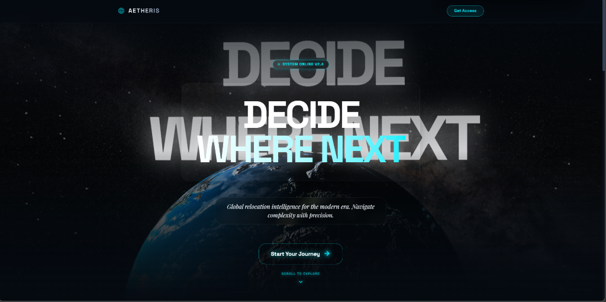
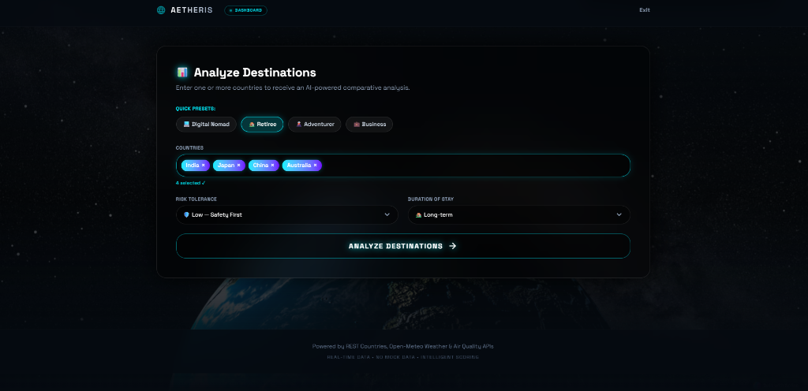
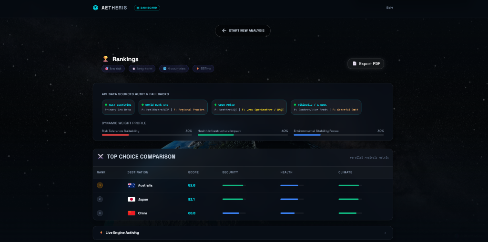
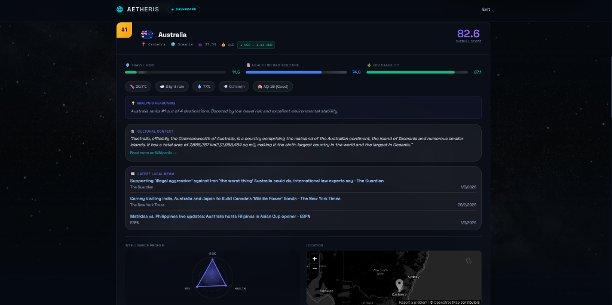
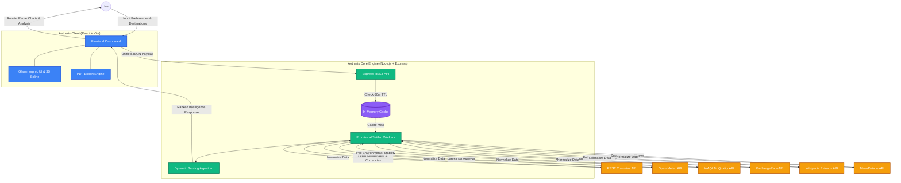

# Aetheris: Global Relocation & Travel Decision Intelligence Engine

A full-stack, enterprise-grade system that aggregates real-time public data, applies multi-factor decision logic, and produces ranked, explainable recommendations for global relocation and travel based on user-defined constraints and personas.

## 🌟 Overview

Aetheris solves the complexity of international relocation by providing an automated Intelligence Engine. Instead of manually cross-referencing Wikipedia, weather apps, exchange rates, and news sites, Aetheris simultaneously queries live global databases to score, rank, and visualize the most optimal destinations based on your unique profile.

---

## � Visual Overview

### 🌌 Immersive Landing Page


### 📊 Intelligence Input Dashboard


### ⚔️ Comparative Analytics Matrix


### 🧠 Deep-Dive Intelligence Report


---

## �🛠️ Tech Stack & Framework Architecture

This project is built using a modern **MERN-style** separated architecture, optimizing for speed, component reusability, and clean API separation.

### **Frontend** (React + Vite)
- **Framework**: React 18 powered by Vite for lightning-fast Hot Module Replacement (HMR) and optimized production builds.
- **Language**: TypeScript for strict type-safety and interface modeling across all components.
- **Styling**: TailwindCSS v4 with a custom dark-mode glassmorphism design system.
- **Animations/3D**: Framer Motion for mounting animations and `@splinetool/react-spline` for the interactive 3D WebGL background.
- **Routing**: `react-router-dom` (BrowserRouter) with SPA fallback configuration for platform hosting (Vercel).
- **Exporting**: `html2pdf.js` for pixel-perfect, multipage, dark-mode PDF generation of intelligence reports.

### **Backend** (Node.js + Express)
- **Framework**: Express.js for REST API routing and middleware management.
- **Language**: Node.js & TypeScript.
- **Caching Engine**: In-memory caching logic preserving 3rd-party API quotas by retaining successful responses for 60 minutes.
- **Concurrency**: `Promise.allSettled` is heavily utilized to fire parallel requests to external data providers, meaning one failing API will not crash the entire calculation pipeline.

---

## 🔌 API Integrations & Data Flow

Aetheris interconnects with several live global APIs to feed the intelligence algorithm:

1. **REST Countries API** (`restcountries.com`): Retrieves foundational geographical data, currencies, and official names. Also powers the heavily optimized AutoComplete Search.
2. **Open-Meteo API**: Fetches real-time weather data (temperature, cloud cover, precipitation) based on exact latitude/longitude coordinates.
3. **World Air Quality Index (WAQI)**: Live environmental stability polling.
4. **ExchangeRate-API**: Live currency conversion mapped uniquely against the user's origin country.
5. **Wikipedia Extracts API**: Pulls relevant cultural, historical, and demographic contexts.
6. **NewsData.io API**: Retrieves recent localized news headlines.

### **Architecture Blueprint & Data Interconnection**



When a user submits their preferences, the Frontend sends a single, unified JSON payload to the Express Backend. The Backend then spawns parallel async workers for *each* selected country, pinging all 6 external APIs concurrently. Once the promises resolve, the Backend aggregates the disparate data formats into a strict `AnalysisResponse` interface and passes it to the scoring algorithm before sending the ranked findings back to the client.

---

## 🧠 Intelligence Scoring Algorithm

The Engine does not use static data; it dynamically weighs real-time metrics against the user's profile:

### **User Personas (Quick Presets)**
- 💻 **Digital Nomad** (Low Risk / Long-term)
- 🏡 **Retiree** (Low Risk / Long-term)
- 🌋 **Adventurer** (High Risk / Short-term)
- 💼 **Business** (Moderate Risk / Short-term)

### **Dynamic Weighting Logic**
The backend mathematically penalizes or rewards countries based on the user's requested `Risk Tolerance` and `Duration of Stay`.
- **Short-term stays** heavily weight Weather conditions and Air Quality (immediate impact).
- **Long-term stays** dramatically increase the weight of Health Infrastructure, Economic Stability, and underlying Travel Risk advisories.
- **Risk Tolerance**: Setting tolerance to "Low" creates an exponential penalty multiplier against countries returning hostile Travel Advisory scores.

---

## 🚀 Key Features

*   **Intelligent AutoComplete**: Fuzzy search prioritizing exact text matches (e.g., searching "India" actively suppresses "British Indian Ocean Territory" to rank the "Republic of India" first).
*   **Radar (Spider) Charts**: Visual mathematical breakdown of how a country scored across different sectors (Safety, Health, Environment) using SVG mapping.
*   **Live Backend Activity Log**: The frontend displays a real-time, terminal-style readout of the exact API response times, parallel fetch statuses, and error fallback states.
*   **Export to PDF**: Utilizing `html2pdf.js`, the entire multi-page complex glassmorphic dashboard can be rendered and downloaded as an A4 PDF without the browser's native print engine destroying the dark aesthetic.

---

## 💻 Quick Setup & Local Development

### 1. Prerequisites
Ensure you have [Node.js](https://nodejs.org/) installed on your machine.

### 2. Backend Setup
1. Navigate to the backend folder: `cd backend`
2. Install dependencies: `npm install`
3. Create a `.env` file and add your API keys:
   ```env
   OPENWEATHER_API_KEY=your_openweathermap_key
   WAQI_TOKEN=your_waqi_token
   NEWS_API_KEY=your_newsdata_key
   ```
4. Start the backend server: `npm run dev` (Runs on `http://localhost:3001`)

### 3. Frontend Setup
1. Open a **new terminal** and navigate to the frontend folder: `cd frontend`
2. Install dependencies: `npm install --legacy-peer-deps` (required for Spline/PDF plugins)
3. Start the Vite React app: `npm run dev` (Runs on `http://localhost:5173`)

---

## ☁️ Deployment (Vercel)

The Aetheris Frontend is proudly hosted on **Vercel**, enabling lightning-fast global delivery. 

By leveraging Vercel's Edge Network, the application guarantees minimal latency and high availability for the static SPA (Single Page Application) bundle, ensuring a smooth, app-like experience for users worldwide regardless of their geographical location.
